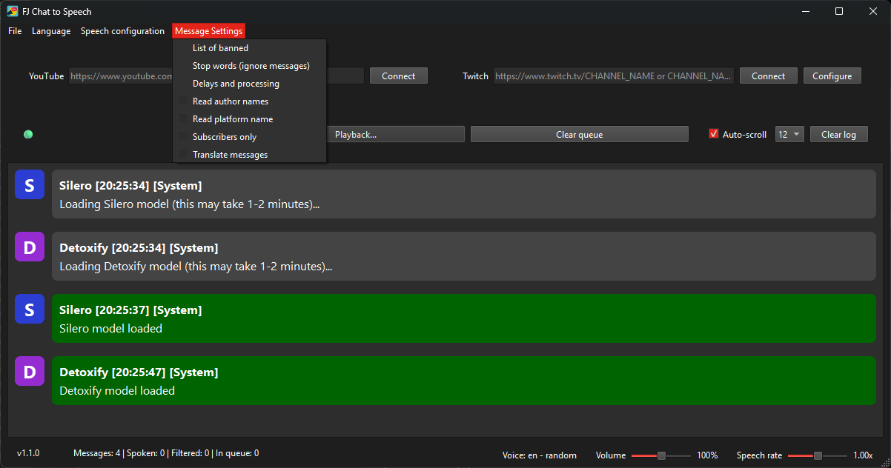
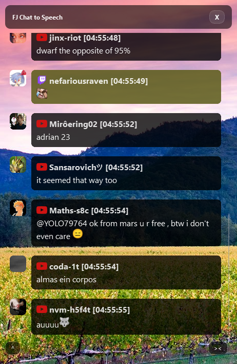

# FJ Chat to Speech




FJ Chat to Speech is an open-source desktop application that converts live chat messages from YouTube and Twitch streams into real-time speech.

- YouTube and Twitch live chat support
- Local text-to-speech with `Silero`
- Local toxicity filtering with `Detoxify`
- English and Russian voices
- Adjustable speech speed and volume
- Stop-word list editor
- List of banned
- English and Russian UI
- Free and open-source

## <a href="https://github.com/facejungle/fj_chat_to_speech/releases/latest/" target="_blank">Download</a>

- `F12` - Chat overlay
- `Arrow Left` / `Arrow Right` - Speech rate
- `Arrow Up` / `Arrow Down` - Volume
- `Space` - Pause/Play

## Reading chat messages by voice

- Flexible choice of messages to be voiced (channel author, donator, sponsor, moderator, regular messages)
- Automatic message translation
- Voiceover of nicknames and platform names
- Voiceover of paid messages
- Spam filters (symbol spam, links)

## Chat Overlay

- Chat overlay at the Always on top
- Stop-words clearing
- Automatic message translation
- Colored message background (channel author, donator, sponsor, moderator)
- Avatars display

## System requirements

- `OS` - Windows, Linux or MacOS
- `Memory` - 3GB RAM

### Linux

```bash
sudo apt install libportaudio2 portaudio19-dev python3-pyaudio libsndfile1 ffmpeg
```

### MacOS

```bash
brew install portaudio
brew install ffmpeg
```

## Connect to YouTube

1. Paste a live stream URL (or video ID) into the YouTube field.
2. Click `Connect`.

## Connect to Twitch

1. Create a Twitch application and copy its `Client ID`.
   - <a href="https://github.com/facejungle/fj_chat_to_speech/wiki/Twitch-CLIENT-ID" target="_blank">How to create Client ID</a>
2. Open Twitch configure in the app paste your `Client ID` and click `Save`.
3. Confirm authorization in your browser (Device Code flow).
4. Enter an active channel name or Twitch URL.
5. Click `Connect`.

## How is the banned list formed?

Each toxic message is assigned a rating. The message is processed by the Detoxify model, which assigns a toxicity level between `0.0` and `1.0`. However, messages with a toxicity level below the value specified in the `Toxicity Threshold` parameter are ignored.

During the application's operation, statistics are accumulated for toxic users. If a user exceeds the value specified in the `Toxicity level for user ban` parameter, they are added to the banned list.

- Messages from banned users will not be voiced.
- Chat moderators and the channel owner cannot be banned.

## Troubleshooting

- Twitch connection fails:
  - Confirm the `Client ID` is valid.
  - Re-run Twitch authorization in app settings.
  - Ensure the channel is live and the name/URL is correct.
- YouTube connection fails:
  - Check that the stream is currently live.
  - Try pasting a direct video URL instead of a shortened link.

Notes:

- On first run, model-related files downloaded and cached.
- The settings file is located in:
  - Windows: `~\AppData\Roaming\FJ Chat to Speech`
  - Linux or MacOS: `~/.fj_chat_to_speech`

## Run from source

Requirement: `Python 3.12`

```bash
git clone https://github.com/facejungle/fj_chat_to_speech.git
cd fj_chat_to_speech

pip install -r torch.requirements.txt
pip install -r requirements.txt

python main.py
```

## Build

```bash
git clone https://github.com/facejungle/fj_chat_to_speech.git
cd fj_chat_to_speech

python build.py
```

Build artifacts are created in `dist/`.

## Thanks for <a href="https://github.com/snakers4/silero-models/" target="_blank">Silero</a> and <a href="https://github.com/unitaryai/detoxify" target="_blank">Detoxify</a>

- **Silero**: We use Silero’s open-source TTS models, known for natural-sounding voices and fast CPU performance
- **Detoxify**: Toxicity filtering is powered by the Detoxify library, which provides pretrained models to flag and filter toxic comments
